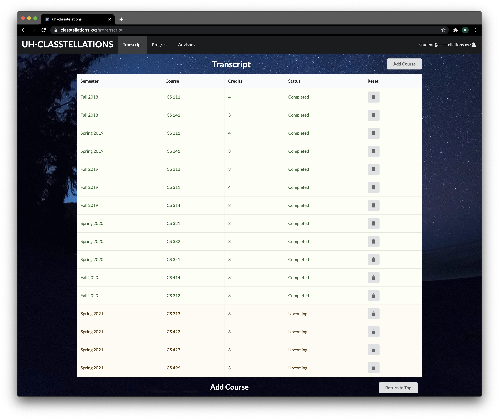
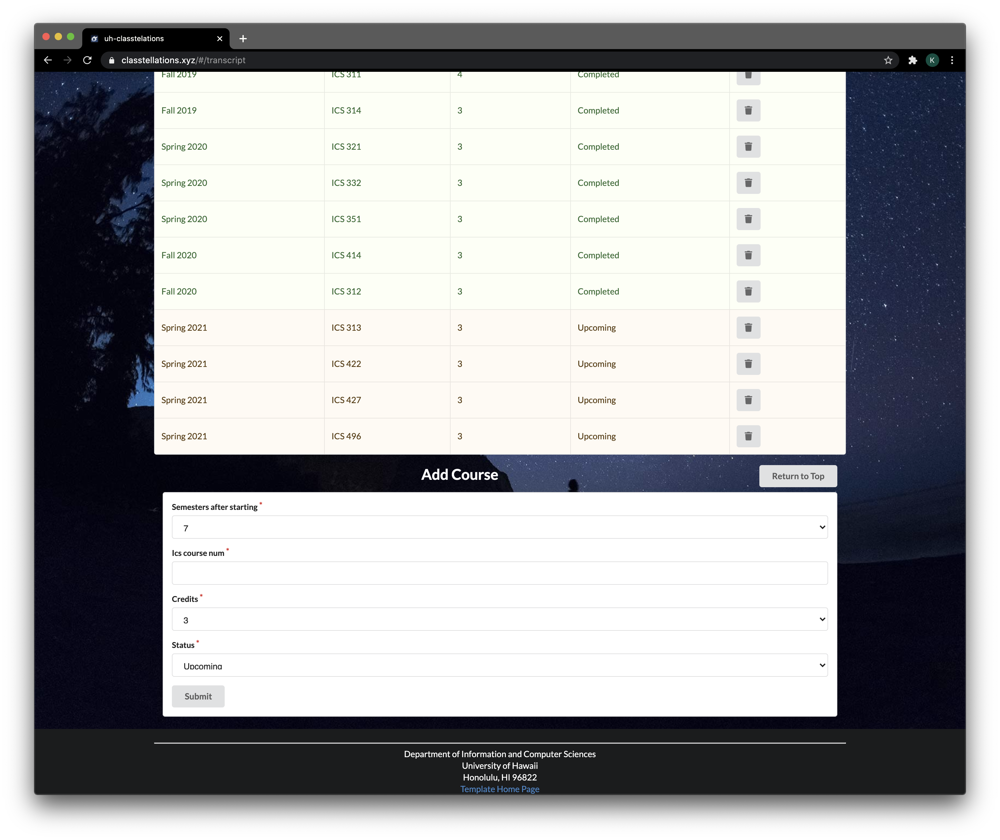

## Table of Contents

* [Overview](#overview)
* [Deployment](#deployment)
* [User Guide](#user-guide)
* [Community Feedback](#community-feedback)
* [Developer Guide](#developer-guide)
* [Development History](#development-history)
* [Continuous Integration](#continuous-integration)
* [Example enhancements](#example-enhancements)
* [Team Members](#team-members)

## Overview

[UH Classtellations](https://github.com/uh-classtellations/uh-classtellations) is an interactive visual guide to help UH
students optimize their path to graduation. By showing progress, prerequisites, and timing of classes, students can
experiment with the ordering of remaining classes with a click-and-drag interface.

A student's progress on general UH requirements and major requirements are indicated along with remaining major classes.
Prerequisite dependencies are shown with arrows along with credit hours totals for each semester.

UH Classtellations utilizes the following frameworks:

* [Meteor](https://www.meteor.com/) for Javascript-based implementation of client and server code.
* [React](https://reactjs.org/) for component-based UI implementation and routing.
* [Semantic UI React](https://react.semantic-ui.com/) CSS Framework for UI design.

Feel free to reference the repositories for [our project](https://github.com/uh-classtellations/uh-classtellations)
and [our Home Page](https://github.com/uh-classtellations/uh-classtellations.github.io).

## Deployment

Our project is deployed on Digital Ocean [here](https://classtellations.xyz).

## User Guide

### Transcript Page

Check out the Transcript page [on Digital Ocean](https://classtellations.xyz/#/transcript).

#### Transcript

* View added courses sorted reverse-chronologically by year and semester, then in descending order by ICS course level.
* Courses are color-coded by status:
    * Upcoming = Orange
    * Complete = Green
* Button links to Add Course Form for ease in navigation.

#### Add Course Form

* Courses can be defined and added to the Transcript with with the Add Course form.
* Button links to top of page for ease in navigation.

### Progress Page

* Click-and-drag to place courses in a given semester
* See semester credit totals and completed credits
* Print progress as a PDF

* Receive alerts to ensure prerequisites are met in your timeline

Check out this page [on Digital Ocean](https://classtellations.xyz/#/progress)

### Advisor Page

* View ICS major advisors
* Click to schedule an appointment via UH Star Balance
* View Graduation Requirements

Check out this page [on Digital Ocean](https://classtellations.xyz/#/list-advisors)

### Login Page

* Log in to resume use of UH Classtellations
* Optional: log in as guest (under development)

Check out this page [on Digital Ocean](https://classtellations.xyz/#/signin)

## Community Feedback

"Aesthetic is cool. Arrows are helpful in following the course order. It is a little unclear how to fill the 'Num'
section of the Add Course form." - J.S.

"Helpful to view progress through the years, simple and easy to use. Clean up arrows on progess page as it can look
confusing." E.G.

"Looks really nice and simple, I really liked how there was a chart that prevents you from putting a class too early.
One thing I would change is having different color arrows because it's kinda hard to see what leads to what." - A.N.

"Has great visual clairity. For advisors page, move undergraduate requirments from the bottom so that it is easier to
view." - N.P.

"The UH Classtellation site is a really nice website that allows me to organize and plan my courses. I love the pathway
that lets me see the classes I need to take and their pre-requisites. As a suggestion, I'd wish the home page to have
more color and contrast with the text; make it more eye-catching when I first enter the site." - G.E.

## Developer Guide

This project requires the downloading of the following libraries:

* jsPDF: documentation can be found [here](https://github.com/MrRio/jsPDF)

* html2canvas: documentation can be found [here](https://html2canvas.hertzen.com/)

* React Beautiful DnD (Drag and Drop): documentation can be
  found [here](https://github.com/atlassian/react-beautiful-dnd)

* React X-Arrows: documentation can be found [here](https://www.npmjs.com/package/react-xarrows)

## Development History

To see our goals & progress, check out the Milestones below:

### Milestone 1: Mockup development

Our goals and progress for Milestone 1 are viewable
at [our Github Repository's Project Page](https://github.com/uh-classtellations/uh-classtellations/projects/2).

### Milestone 2: Data model development

Our goals and progress for Milestone 2 are viewable
at [our Github Repository's Project Page](https://github.com/uh-classtellations/uh-classtellations/projects/3).

### Milestone 3: Final touches

Our goals and progress for Milestone 1 are viewable
at [our Github Repository's Project Page](https://github.com/uh-classtellations/uh-classtellations/projects/4).

## Example enhancements

The following enhancements could be made for improved utility:

* Indication of available courses to satisfy general eduction requirements (requires direct interaction with STAR
  database). STAR currently has a user-friendly search for this, but direct integration into the visualizer could be
  helpful.
* Support for departments beyond ICS
* Support for double majors
* Support for prospective students (who don’t have a MyUH account) and are willing to manually enter AP credits, etc.
* Long-term: interaction with STAR’s actual enrollment system.

## Team Members

### Kevin Lee

Kevin is in his senior year in Computer Engineering. He plans on pursuing a career in data analytics or electrical
engineering involving telecommunication systems. He is just taking this class because he needs a technical elective but
he is having a lot of fun and is learning a lot. For more information about Kevin and his previous projects, please
visit his [portfolio](https://krnkev.github.io/).

### Jessica Tang

Jessica is in her junior year at the University of Hawaii at Manoa and pursuing a B.S. in Computer Science. She hopes to
be able to create useful websites to help others and hopefully UH Classtellations will be a great first step. For more
information about Jessica and her previous projects, please visit her [portfolio](https://jktang342.github.io/).

### Alison Tomooka

Alison is in her third year at University of Hawaii at Manoa and pursuing a B.A. in Economics, along with a minor in
Computer Science. Through UH Classtellations, she hopes to help other students keep track of their academic progress and
achieve their educational goals. For more information about Alison and her previous projects, please
visit [her portfolio](https://alison-t.github.io/).

### Kiko Whiteley

Kiko is a junior majoring in Computer Science and Mathematics, looking to work as a a data science researcher, analyst,
or engineer. He hopes that UH Classtellations will be a useful visual aid for UH ICS students to optimize their path
toward graduation and seeks to broaden his knowledge in building interactive web interfaces while working on the
project. For further details, you can see [his Github portfolio](https://keekss.github.io/).
