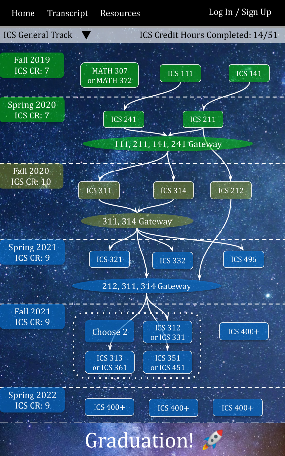

## Table of contents

* [Overview](#overview)
* [Team Members](#team-members)
* [Page Mockups](#page-mockups)
* [Development History](#development-history)
* [User Guide](#user-guide)
* [Community Feedback](#community-feedback)
* [Developer Guide](#developer-guide)
* [Continuous Integration](#continuous-integration)
* [Walkthrough videos](#walkthrough-videos)
* [Example enhancements](#example-enhancements)

## Overview

[UH Classtellations](https://github.com/uh-classtellations/uh-classtellations) is an interactive visual guide to help UH students optimize their path to graduation.  By showing progress, prerequisites, and timing of classes, students can experiment with the ordering of remaining classes with a click-and-drag interface.

A student's progress on general UH requirements and major requirements are indicated along with remaining major classes.  Prerequisite dependencies are shown with arrows along with credit hours totals for each semester.

UH Classtellations utilizes the following frameworks:

* [Meteor](https://www.meteor.com/) for Javascript-based implementation of client and server code.
* [React](https://reactjs.org/) for component-based UI implementation and routing.
* [Semantic UI React](https://react.semantic-ui.com/) CSS Framework for UI design.
* [Uniforms](https://uniforms.tools/) for React and Semantic UI-based form design and display.

Feel free to reference the repositories for [our project](https://github.com/uh-classtellations/uh-classtellations) and [our home page](https://github.com/uh-classtellations/uh-classtellations.github.io), and view our project [on digital ocean](http://138.197.222.6).

## Team Members

### Kevin Lee

Kevin is in his senior year in Computer Engineering. He plans on pursuing a career in data analytics or electrical engineering involving telecommunication systems. He is just taking this class because he needs a technical elective but he is having a lot of fun and is learning a lot. For more information about Kevin and his previous projects, please visit his [portfolio](https://krnkev.github.io/).

### Jessica Tang

Jessica is in her junior year at the University of Hawaii at Manoa and pursuing a B.S. in Computer Science. She hopes to be able to create useful websites to help others and hopefully UH Classtellations will be a great first step. For more information about Jessica and her previous projects, please visit her [portfolio](https://jktang342.github.io/).

### Alison Tomooka

Alison is in her third year at University of Hawaii at Manoa and pursuing a B.A. in Economics, along with a minor in Computer Science. Through UH Classtellations, she hopes to help other students keep track of their academic progress and achieve their educational goals. For more information about Alison and her previous projects, please visit her [portfolio](https://alison-t.github.io/).

### Kiko Whiteley

Kiko is a junior majoring in Computer Science and Mathematics, looking to work as a a data science researcher, analyst, or engineer.  He hopes that UH Classtellations will be a useful visual aid for UH ICS students to optimize their path toward graduation and seeks to broaden his knowledge in building interactive web interfaces while working on the project.  For further details, you can see [his Github portfolio](https://keekss.github.io/).

## Page Mockups

### Transcript Page

* Select past and current courses from a dropdown menu
* View and edit the list of past and current courses

Check out this page [on Digital Ocean](http://138.197.222.6/#/transcript)

### Progress Page

* Choose track (top)
* Classes, gateways, and semesters
  * Green: past
  * Yellow: current
  * Blue: future
* Prerequisites shown w/ arrows
* Click-and-drag into a given semester requires prerequisite(s) completed
* Semester-wise and total credit hours shown

Check out this page [on Digital Ocean](http://138.197.222.6/#/progress)

### Advisor Page

* View ICS major advisors
* Click to schedule an appointment via UH Star Balance

Check out this page [on Digital Ocean](http://138.197.222.6/#/list-advisors)

### Login Page

* Log in to resume use of UH Classtellations
* Optional: log in as guest (under development)

Check out this page [on Digital Ocean](http://138.197.222.6/#/signin)
img style="height: 400px; width: auto;" src="images/m1-login.png">

## Development History

To see our goals & progress, check out the Milestones below:

### Milestone 1: Mockup development

Our goals and progress for Milestone 1 are viewable at [our Github Repository's Project Page](https://github.com/uh-classtellations/uh-classtellations/projects/2).

### Milestone 2: Data model development

Our goals and progress for Milestone 1 are viewable at [our Github Repository's Project Page](https://github.com/uh-classtellations/uh-classtellations/projects/3).

### Milestone 3: Final touches

_This section is currently under development._

## User Guide

_This section is currently under development._

## Community Feedback

_This section is currently under development._

## Developer Guide

_This section is currently under development._

### Application Design

_This section is currently under development._

### Data model

_This section is currently under development._

## Initialization

_This section is currently under development._

### Quality Assurance

_This section is currently under development._

#### ESLint

_This section is currently under development._

#### End to End Testing

_This section is currently under development._

## From mockup to production

_This section is currently under development._

## Continuous Integration

_This section is currently under development._

## Walkthrough videos

_This section is currently under development._

## Example enhancements

The following enhancements could be made for improved utility:

* Indication of available courses to satisfy general eduction requirements (requires direct interaction with STAR database). STAR currently has a user-friendly search for this, but direct integration into the visualizer could be helpful.
* Support for departments beyond ICS
* Support for double majors
* Support for prospective students (who don’t have a MyUH account) and are willing to manually enter AP credits, etc.
* Long-term: interaction with STAR’s actual enrollment system.